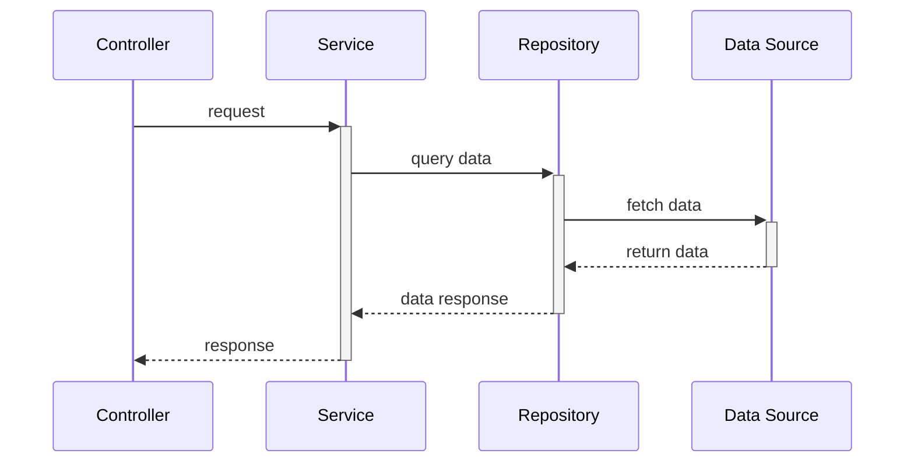
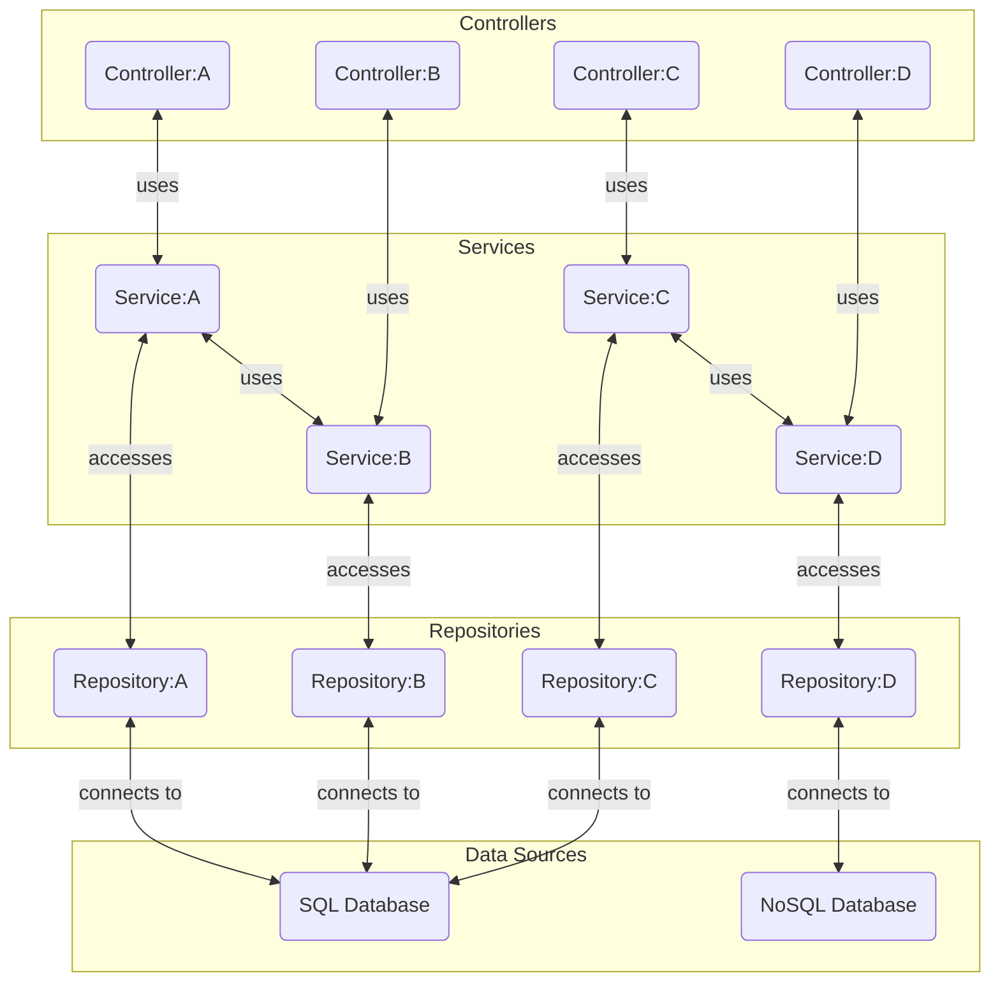

# Jobs + Providers API
Backend Service for serving and computing Job and Provider data

## Doc Todos
- [ ] **Project Structure:** Diagram with descriptions in each
- [ ] **Flow of Command and Terminology:** 
- [ ] **Engines & Algorithms:** Diagram Metrics calculations, state definitions, and weighing system

## Getting Started
### Requirements
- [**Node (version 20)**](https://nodejs.org/en/download/package-manager) -- runtime environment
- [**Docker**](https://docs.docker.com/engine/install/) -- optional; required for containerized environment

### Run the Applications
1. Install dependencies: `npm i`
2. Run application in dev-mode: `npm run dev`

Run a healthcheck to ensure system is operational:
```sh
> curl localhost:5000/ping

## should receive `{ message: pong }` on success
```

## Application Structure and Workflow
### Directory Structure 
[tree -d -I 'node_modules|dist']: # 
```
src
├── constants      ----~~> shared constants; eg, hashmaps, base data sets
├── controllers    ----~~> request + response handling layer
├── engines        ----~~> systems for more complex computations
├── middleware     ----~~> application pipelines for validating and preparing data 
├── repositories   ----~~> data access layer; reads from CSV files
│   ├── data       ----~~> CSV file repository
│   └── transforms ----~~> parsing agents for data normalization
├── routes         ----~~> URL routing components, directory structure reflective of URL pathing implemented
│   ├── jobs
│   └── ping
├── services       ----~~> application logic layer
├── types          
│   ├── domains    ----~~> entity-specific models for app logic
│   │   ├── job
│   │   ├── provider
│   │   └── shared   --~~> types in multiple domains
│   ├── metrics    ----~~> data computation models
│   └── utils      ----~~> utility function types 
└── utils
    ├── computations --~~> analysis and mathematical operations
    ├── streams      --~~> stream-based data flows
    │   └── csvReader   ~> CSV readstream utility
    │       └── pipes   ~> CSV readstream specific pipes
    └── transforms   --~~> data mapping processes
```

## Workflows
### Request/Response Lifecycle 


### Workflow Relations

##### Example:


## Processes

### Weighing Algorithm
- [ ] Document purpose of algorithm and how score values are computed
- [ ] Note Point Buying System

### Engine Structures and Relations
- [ ] Diagram generic metric, state, and weighing system

### How Providers are Scored
- [ ] Document scoring specifically for Providers

