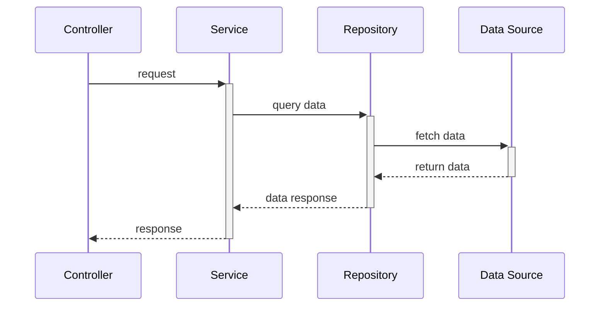
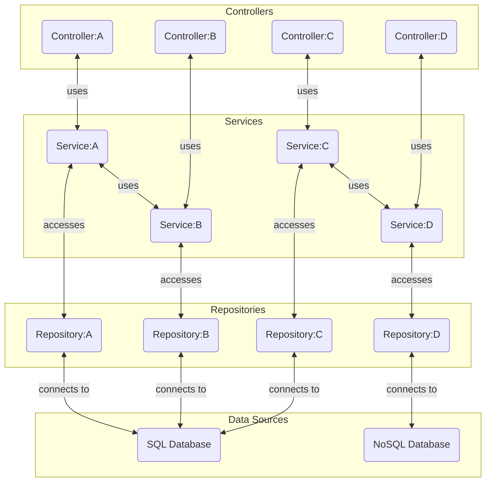

# Jobs + Providers API
Backend Service for serving and computing Job and Provider data

## Getting Started
### Requirements
- [**Node (version 20)**](https://nodejs.org/en/download/package-manager) -- runtime environment
- [**Docker**](https://docs.docker.com/engine/install/) -- optional; required for containerized environment

### Run the Applications
1. Install dependencies: `npm i`
2. Run application in dev-mode: `npm run dev`

Run a healthcheck to ensure system is operational:
```sh
> curl localhost:5000/ping

## should receive `{ message: pong }` on success
```

## Application Structure and Workflow
### Directory Structure 
[tree -d -I 'node_modules|dist']: # 
```
src
├── constants      ----~~> shared constants; eg, hashmaps, base data sets
├── controllers    ----~~> request + response handling layer
├── engines        ----~~> systems for more complex computations
├── middleware     ----~~> application pipelines for validating and preparing data 
├── repositories   ----~~> data access layer; reads from CSV files
│   ├── data       ----~~> CSV file repository
│   └── transforms ----~~> parsing agents for data normalization
├── routes         ----~~> URL routing components, directory structure reflective of URL pathing implemented
│   ├── jobs
│   └── ping
├── services       ----~~> application logic layer
├── types          
│   ├── domains    ----~~> entity-specific models for app logic
│   │   ├── job
│   │   ├── provider
│   │   └── shared   --~~> types in multiple domains
│   ├── metrics    ----~~> data computation models
│   └── utils      ----~~> utility function types 
└── utils
    ├── computations --~~> analysis and mathematical operations
    ├── streams      --~~> stream-based data flows
    │   └── csvReader   ~> CSV readstream utility
    │       └── pipes   ~> CSV readstream specific pipes
    └── transforms   --~~> data mapping processes
```

## Workflows
### Request/Response Lifecycle 


### Workflow Relations and Conventions
- Controllers, Services, and Repositories are narrowed to the scope of their Domain
- Controllers will utilize their correlated domain Service for data processing and retrieval
- Services may utilize other domain Services for evaluating relational data to their domain
- Services will only access data through their correlated domain Repository

#### Example ERD:


## Job Score Calculation for Providers
Job scores for Providers are calculated by the following criterion:
- **Speed:** How quickly they completed their work
- **Cost:**  How much they charged in comparison to pages completed
- **Rating**: How satisfied customers have been with their work
- **Proximity**: If Location-based, how close they are located to the specified upcoming job

### Calculation Process
#### Collect Historical Data for Provider
The following metrics are calculated from the provider's completed job history:
- **Speed:** Average time between job creation and completion
- **Cost:**  Average cost per page for all completed jobs
- **Rating**: Average satisfaction score from their clients

#### Calculate Relative Position to Historical Job Metrics
For each Provider's Job Score Averages, a percentage score is calculated by the Provider's relative position against all historic job completions. 

- Highest and Lowest values are pulled from all historically Completed Jobs for each Job Performance Metrics (Speed, Cost, Rating)
- The Provider is then given a percentage score for the metric based on their average score's relative position between the highest and lowest metrics. 
>E.G., if Provider's Rating === Highest Aggregate Rating, Provider's Percentage score for Rating is 100%
- Inverses are applied on the averages where the lower positioning is more favorable (Speed, Cost)
> if Provider's Cost === Highest Aggregate Cost, Provider's Percentage score for Cost is 0%

#### Weighing Recalculations (via Point Buying) 
After relative position percentage scores are calculated, 
the Provider's percentage scores are recalculated by the weight adjustment chosen by the Requester. 

Requesters may choose a value be between 1 and 5 for each job score metrics (Speed, Cost, Rating, Proximity):

1. Halves score
2. Reduces score by 25%
3. No change.
4. Increases score by 25%
5. Increases score by 50%

Percentage score and score weights are normalized to stay within their respective ranges (1-100%, 1-5)

#### RESTful Context - Query Params
- Query parameters may be set on the `/jobs/:id` request to apply the metric weight adjustment
- Format: `?speed=4&cost=2` adjusts Speed and Cost scores.
- No parameters default all scores to neutral (3).

#### Final Job Score, Ranking
After recalculating scores by the applied weight, the final job score for a Provider is an aggregate averaging all four metrics of Provider's percentage scores.

Once final job scores are calculated, Providers are ranked in descending order of their aggregate percentage scores.


